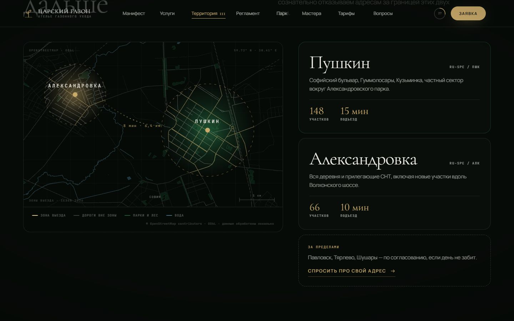
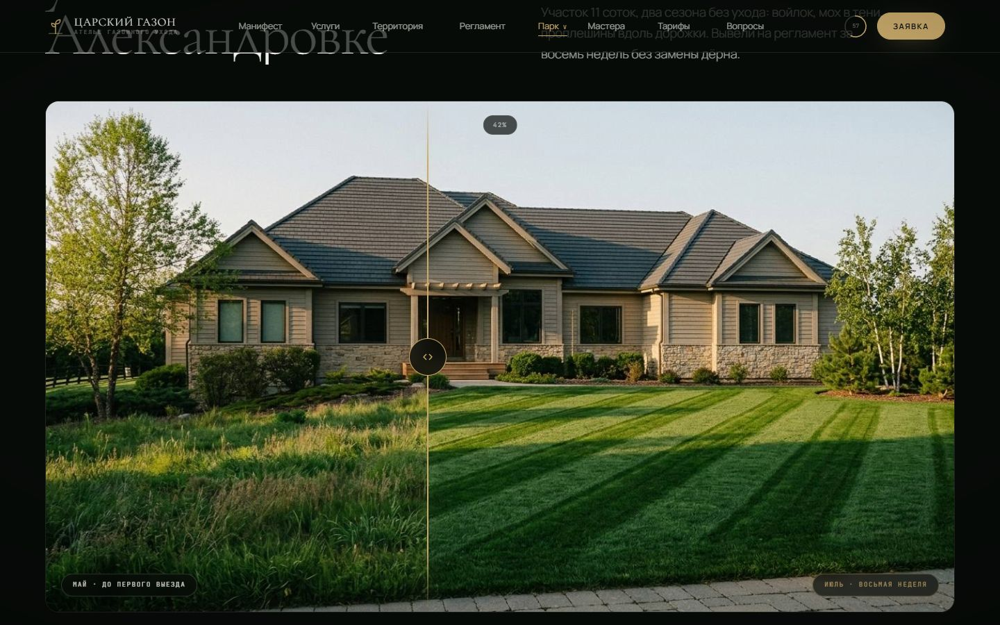
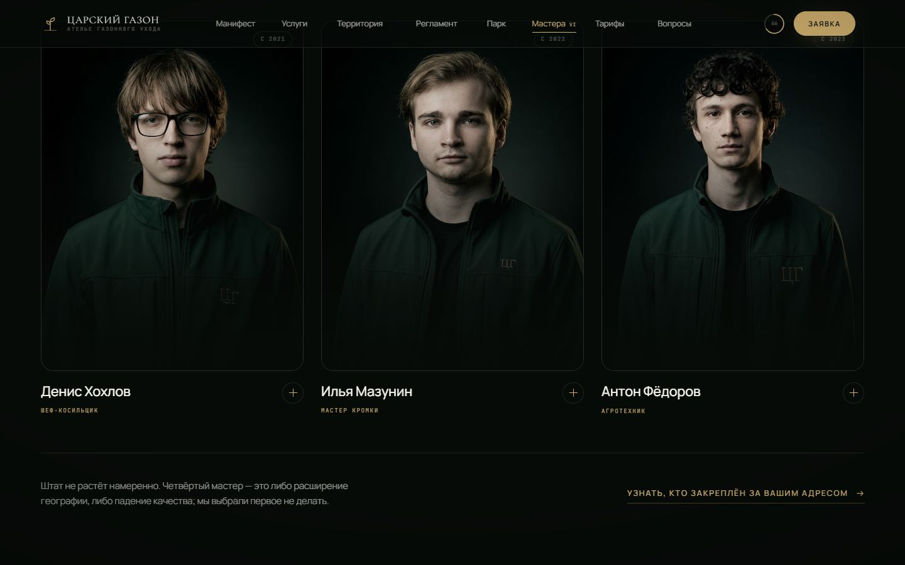
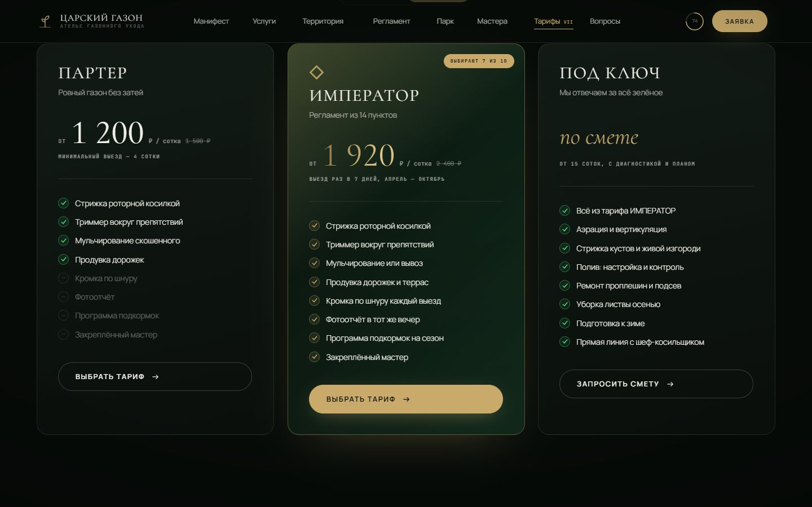
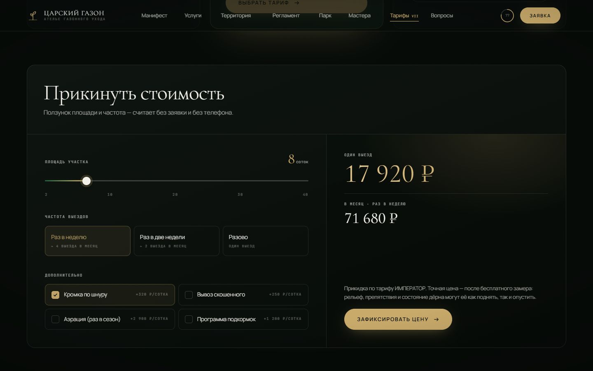
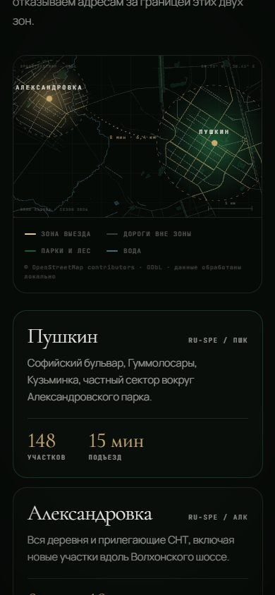

<div align="center">

# ЦАРСКИЙ ГАЗОН

**Ателье газонного ухода в Пушкине и Александровке**

Одностраничный сайт с 3D-полем травы на WebGL и картой территории,
собранной из данных OpenStreetMap.

[](https://github.com/kewldan/tsar-trava/actions/workflows/ci.yml)
[](https://github.com/kewldan/tsar-trava/actions/workflows/deploy.yml)
[](LICENSE)

### [→ Открыть сайт](https://kewldan.github.io/tsar-trava/)

</div>


---

## Что внутри

Первый экран — не видео и не картинка. Это поле травы, которое рисуется в
реальном времени: от 14 до 72 тысяч травинок одним инстансным вызовом, ветер и
изгиб листа считаются в вершинном шейдере, курсор расталкивает траву, а по полю
идёт диагональный рисунок покоса — тот самый, ради которого люди и заказывают
уход. На прокрутке камера поднимается над покровом.

Карта территории — настоящая геометрия улиц Пушкина и Александровской,
а не картинка и не тайловый сервис.

<table>
<tr>
<td width="50%"></td>
<td width="50%"></td>
</tr>
<tr>
<td><b>Территория.</b> Данные OSM, покрашенные в палитру сайта. Внутри зон выезда дорожная сеть светится латунью — это отдельный слой через SVG-маску.</td>
<td><b>Услуги.</b> Карточки с 3D-наклоном и бликом, который следует за курсором.</td>
</tr>
</table>

<table>
<tr>
<td width="50%"></td>
<td width="50%"></td>
</tr>
<tr>
<td><b>Регламент.</b> Пять шагов едут горизонтально при вертикальной прокрутке — секция пиннится через GSAP ScrollTrigger. На узких экранах разворачивается в обычную колонку.</td>
<td><b>Парк техники.</b> Ножницы — модель из <code>public/models/</code> с материалами из палитры сайта; половинки щёлкают, а скорость подхватывают от скорости прокрутки страницы.</td>
</tr>
</table>

<table>
<tr>
<td width="50%"></td>
<td width="50%"></td>
</tr>
<tr>
<td><b>До / после.</b> Один участок в двух состояниях, шторка тянется мышью, клавишами и пальцем.</td>
<td><b>Мастера.</b> Карточка раскрывается по клику, поверх портрета проступают фирменные полосы покоса.</td>
</tr>
</table>

<table>
<tr>
<td width="50%"></td>
<td width="50%"></td>
</tr>
<tr>
<td><b>Тарифы.</b> Переключатель «разово ↔ сезон» пересчитывает все три карточки.</td>
<td><b>Калькулятор.</b> Площадь, частота и допуслуги считаются на лету — без заявки и без телефона.</td>
</tr>
</table>

### На телефоне

<div align="center">



</div>

На узких экранах карта берётся более плотным кадром, иначе подписи нечитаемы,
горизонтальный пиннинг заменяется вертикальной раскладкой, а 3D-сцена
переходит на облегчённый набор травинок.

---

## Стек

|          |                                                                  |
| -------- | ---------------------------------------------------------------- |
| Сборка   | Vite 8 (Rolldown), TypeScript 7                                  |
| UI       | React 19                                                         |
| 3D       | three.js 0.185 через `@react-three/fiber` 9, собственные шейдеры |
| Анимация | GSAP 3.15 + ScrollTrigger, Lenis, CSS-переходы                   |
| Качество | Biome 2.5 (`preset: all`), дымовой прогон в Playwright           |
| Хостинг  | GitHub Pages через GitHub Actions                                |

Библиотеки готовых компонентов не используются: `drei` не подключён, всё
3D написано на голом three.js, выпадающий список — свой, по шаблону combobox
из ARIA APG, потому что нативный `<select>` рисует система и он не поддаётся
стилям. Вся вёрстка — обычный CSS с переменными,
без препроцессоров и рантайм-стилей.

Итоговый вес: **~415 КБ gzip**, из них 185 КБ — сам three.js.

## Структура

```
src/
  content.ts              ← ВЕСЬ текст, цены, тарифы, команда, FAQ. Правки — сюда
  App.tsx                 порядок секций, Lenis, прелоадер
  components/             секции страницы
    ui/Primitives.tsx     Reveal, SplitText, Counter, Magnetic, Marquee, Btn
    OsmMap.tsx            карта территории
  three/
    GrassScene.tsx        поле травы на первом экране
    grassShaders.ts       GLSL: ветер, полосы покоса, туман, пыльца
    Scissors.tsx          маникюрные ножницы в блоке «Парк»
  styles/
    base.css              токены, типографика, утилиты
    ui.css                примитивы, курсор, прелоадер, навигация
    sections.css          секции
  data/pushkin-map.json   геометрия карты, 58 КБ
  lib/hooks.ts            useInView, useTilt, useMagnetic, useCountUp и прочее

public/team/              портреты мастеров
public/models/            модель ножниц для блока «Парк»
scripts/
  build-map.mjs           пересборка карты из OpenStreetMap
  smoke.mjs               дымовой прогон собранной страницы
  shots.mjs               съёмка скриншотов для этого README
  optimize-images.mjs     пережатие фотографий в public/
```

## Запуск

Нужен Node 20.19+, 22.13+ или 24+ — планку задаёт Vite 8.

```bash
npm install
npm run dev        # http://localhost:5173
```

| Команда             | Что делает                                            |
| ------------------- | ----------------------------------------------------- |
| `npm run dev`       | дев-сервер                                            |
| `npm run build`     | проверка типов + сборка в `dist/`                     |
| `npm run preview`   | посмотреть собранное                                  |
| `npm run typecheck` | только `tsc --noEmit`                                 |
| `npm run check`     | Biome: формат, линт, порядок импортов                 |
| `npm run check:fix` | то же с автоправкой                                   |
| `npm run verify`    | всё вместе: типы → `biome ci` → сборка                |
| `npm run smoke`     | дымовой прогон собранной страницы в Chromium          |
| `npm run shots`     | пересоздать скриншоты для этого README                |
| `npm run images`    | пережать фотографии в `public/` после добавления новых |

Дымовой прогон и скриншоты запускаются по готовому `dist/`:

```bash
npx playwright install chromium   # один раз
npx vite build
npm run smoke                     # поднимает страницу в Chromium и проверяет её
npm run shots                     # пересоздаёт docs/screenshots/
```

## Частые правки

**Тексты, цены, тарифы, команда, FAQ** — всё в `src/content.ts`. Цифры нигде
не продублированы: поменяли в одном месте — поменялось на странице и в
калькуляторе.

**Контакты** — объект `CONTACTS` там же. Форма сейчас собирает сообщение и
открывает Telegram с готовым текстом, потому что на GitHub Pages нет бэкенда.
Появится эндпоинт — впишите его в `formEndpoint`, и форма начнёт слать `POST`
без других изменений.

**Портреты мастеров** — положить файл в `public/team/`, прописать имя в поле
`photo` в массиве `TEAM`. Кадр 3:4.

**Любое новое фото** — после добавления прогнать `npm run images`. Снимки из
генераторов весят под мегабайт каждый; скрипт ужимает их Chromium-ом, который
и так стоит для дымового прогона, и повторным запускам не вредит.

**Палитра** — CSS-переменные в начале `src/styles/base.css`. Цвета 3D-сцены
задаются отдельно, объектом `C` в `src/three/GrassScene.tsx`.

## Карта

Обычно в такие блоки вставляют Google Maps или Leaflet с чужими тайлами: сайт
начинает зависеть от внешнего сервиса, тянет лишний JS и выглядит чужеродно.

Здесь по-другому. Геометрия выгружена из OpenStreetMap через Overpass один раз,
на этапе подготовки данных: дороги, железная дорога, вода, парки и лесные
массивы в рамке 59.68–59.76° N, 30.28–30.48° E. Затем спроецирована в
Web Mercator, упрощена алгоритмом Дугласа–Пекера и сохранена плоскими массивами
координат — получилось 58 КБ на 1662 объекта.

Рисует её собственный SVG-рендерер: каждый слой — один `<path>`, поэтому сотни
улиц стоят браузеру одного узла. Раз рендерим сами — красим в палитру сайта,
подсвечиваем зоны выезда через маску и анимируем как захотим.

Пересобрать карту (другие границы, другие слои) — инструкция в шапке
[`scripts/build-map.mjs`](scripts/build-map.mjs).

Данные © OpenStreetMap contributors, лицензия ODbL.

## 3D и производительность

Число травинок выбирается по устройству — по ширине экрана, типу указателя и
числу ядер: 14 000 на телефоне, 42 000 на среднем ноутбуке, 72 000 на десктопе.
Всё поле — один инстансный меш; ветер, изгиб, полосы покоса и расталкивание
курсором считаются в вершинном шейдере, на CPU не уходит ничего.

Несколько решений, которые заметны на слабых машинах:

- **Прелоадер ждёт не таймер, а первый отрисованный кадр WebGL.** Сцена
  монтируется сразу под ним, поэтому шейдеры компилируются и геометрия
  собирается, пока идёт полоса загрузки — без рывка на входе.
- **Ниже первого экрана сцена уходит в `frameloop="never"`.** На остальных
  20 000 пикселей страницы кадры не рисуются вообще.
- **Никакого `filter: blur()` на элементах, которые двигаются при прокрутке** —
  он пересчитывается каждый кадр.
- **Ножницы монтируются только когда блок в зоне видимости** и размонтируются,
  когда уходит.
- При `prefers-reduced-motion: reduce` анимации выключаются, 3D-сцена не
  монтируется, прелоадер сразу пропускает страницу.

## CI

Два workflow:

**`ci.yml`** — на каждый push и pull request:

- _Типы и Biome_ — `tsc` и `biome ci` запускаются независимо, так что с одного
  прогона видно все проблемы сразу, а не первую попавшуюся. Biome развешивает
  аннотации прямо в диффе пул-реквеста.
- _Сборка_ — собирает `dist`, печатает таблицу размеров в сводку прогона и
  падает, если суммарный gzip превысил 520 КБ. Это страховка от случайного
  тяжёлого импорта.
- _Дымовой прогон_ — поднимает собранную страницу в настоящем Chromium на трёх
  разрешениях (390, 820, 1600) и проверяет, что React отрисовал разметку, все
  секции на месте, WebGL стартовал, прелоадер ушёл, в консоли нет ошибок и нет
  горизонтальной прокрутки. При падении складывает скриншот в артефакты.

**`deploy.yml`** — на push в `main` собирает и публикует на GitHub Pages.

### Линтер

Проверки — Biome с `preset: "all"`, то есть включено всё, что он умеет.
Исключения выставлены точечно и каждое снабжено причиной прямо в `biome.jsonc`:
правила для чужих фреймворков (Solid, Qwik, Next.js), `noMagicNumbers` — в коде,
наполовину состоящем из коэффициентов шейдеров и координат `viewBox`, и
`noUnnecessaryConditions`, у которого пока неполный вывод типов: на одинаковых
`const el = ref.current; if (!el) return` он выдаёт то «условие всегда истинно»,
то «всегда ложно». Убрать эти проверки — уронить страницу.

Для `src/three/**` дополнительно снят `noUnknownAttribute`: react-three-fiber
расширяет JSX элементами three.js, и `<mesh>` с `<shaderMaterial>` Biome
проверять не умеет.

Единичные послабления стоят строкой `biome-ignore` у места с объяснением,
почему там иначе нельзя, — общего списка «чтобы замолчало» в конфиге нет.

## Деплой

Публикация настроена: GitHub Pages включены в режиме GitHub Actions, каждый
push в `main` пересобирает и выкатывает сайт.

Если переименовать репозиторий — поменяйте `const REPO` в `vite.config.ts`,
от него зависит `base` для путей к ассетам (и `PREFIX` в двух скриптах в
`scripts/`). Свой домен — положите `public/CNAME` с доменом и пропишите
CNAME-запись у регистратора.

## Лицензия

Код — [MIT](LICENSE).

Под лицензию на код не подпадают: `src/data/pushkin-map.json` (производная от
данных OpenStreetMap, ODbL — атрибуция обязательна), портреты в `public/team/`
(права у изображённых людей), подключаемые шрифты (SIL OFL 1.1) и тексты
с фирменным оформлением сервиса. Подробности — в файле [LICENSE](LICENSE).

---

<div align="center">
<sub>Данные карты © OpenStreetMap contributors · ODbL</sub>
</div>
